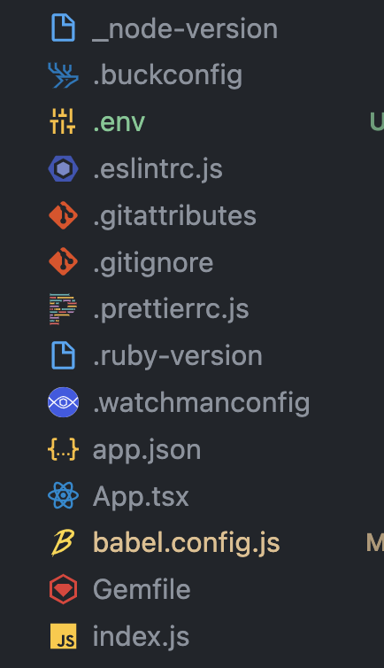
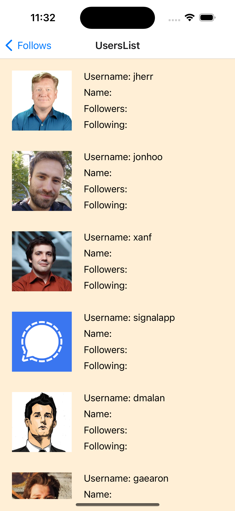

# doc

# How to run?

1. go to [Personal Access Token Tutorial](https://docs.github.com/en/authentication/keeping-your-account-and-data-secure/creating-a-personal-access-token)
2.  create personal token access
3. create `.env` in root path
    
    
    
4. add your token to `.env` file `TOKEN = YOUR_TOKEN`
    
    
    

### run on ios

1. yarn or  npm i
2. npx pod-install
3. yarn ios or npm run ios

### run on android

1. yarn or npm i 
2. yarn android or npm run android

# what it does?

1. search users using github API
    
    
    
2. look up their followers/ followings
    
    
    
3. navigate deeper to followers’ followings
    
    